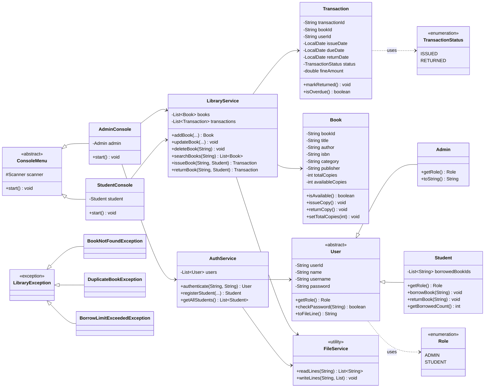

# Library Management System (Core Java)

A complete, console-based **Library Management System** built entirely in
**Core Java** — no Spring, no external frameworks, no third-party libraries.
It uses plain text files for persistence, the Collections Framework for
in-memory data handling, and a clean, layered package structure suitable
for a B.Tech CSE internship / academic final submission.

---

## 1. Features

### Common
- Secure-enough login system with two roles: **Admin** and **Student**
- Self-service **Student registration** from the main menu
- All data (books, users, transactions) persisted to plain text files and
  reloaded automatically on the next run
- Robust input validation and custom exception handling everywhere — the
  app never crashes on bad input

### Admin
| # | Feature |
|---|---------|
| 1 | Add a new book |
| 2 | Update an existing book (title, author, ISBN, category, publisher, copies) |
| 3 | Delete a book (blocked while copies are on loan) |
| 4 | Search books by ID / Title / Author / any field |
| 5 | View all books in the catalog |
| 6 | Issue a book to any registered student |
| 7 | Return a book on behalf of any student |
| 8 | View the full transaction (issue/return) history |
| 9 | View currently overdue books |
| 10 | View all registered students |

### Student
| # | Feature |
|---|---------|
| 1 | View all currently available books |
| 2 | Search books by ID / Title / Author / any field |
| 3 | Borrow a book (max 3 books at a time, enforced automatically) |
| 4 | Return a borrowed book (late fee auto-calculated) |
| 5 | View my currently borrowed books |
| 6 | View my own borrowing history |

---

## 2. Tech Stack

- **Language:** Java (compatible with **JDK 17+**, also compiles cleanly on JDK 21)
- **UI:** Plain console (`System.in` / `System.out`), menu-driven
- **Persistence:** Pipe-delimited (`|`) plain text files under `data/` (no database, no JDBC)
- **Libraries used:** only `java.util`, `java.io`, `java.nio.file`, `java.time` — all part of core Java
- **No frameworks, no Maven/Gradle required** — compiles with plain `javac`

---

## 3. Folder Structure

```
LibraryManagementSystem/
├── README.md                     <- this file
├── run.sh                        <- compile & run helper (Linux/macOS)
├── run.bat                       <- compile & run helper (Windows)
├── .gitignore
├── data/                         <- persisted data (ships with sample data)
│   ├── books.txt
│   ├── users.txt
│   └── transactions.txt
└── src/
    └── com/library/
        ├── main/                 <- application entry point & console UI
        │   ├── Main.java
        │   ├── ConsoleMenu.java       (abstract base menu)
        │   ├── AdminConsole.java      (extends ConsoleMenu)
        │   └── StudentConsole.java    (extends ConsoleMenu)
        │
        ├── models/                <- plain data + domain behaviour (POJOs)
        │   ├── User.java          (abstract)
        │   ├── Admin.java         (extends User)
        │   ├── Student.java       (extends User)
        │   ├── Book.java
        │   ├── Transaction.java
        │   ├── Role.java          (enum)
        │   └── TransactionStatus.java (enum)
        │
        ├── services/              <- business logic & persistence
        │   ├── LibraryService.java   (book catalog + issue/return rules)
        │   ├── AuthService.java      (login, registration, user storage)
        │   └── FileService.java      (low-level file read/write)
        │
        ├── utils/                 <- cross-cutting helpers
        │   ├── Constants.java
        │   ├── InputValidator.java
        │   └── IDGenerator.java
        │
        └── exceptions/            <- custom checked exceptions
            ├── LibraryException.java          (common base)
            ├── BookNotFoundException.java
            ├── BookNotAvailableException.java
            ├── DuplicateBookException.java
            ├── DuplicateUserException.java
            ├── BorrowLimitExceededException.java
            ├── TransactionNotFoundException.java
            ├── AuthenticationException.java
            └── InvalidInputException.java
```

---

## 4. How to Build & Run

### Option A — using the helper scripts
```bash
# Linux / macOS
chmod +x run.sh   # only needed once
./run.sh
```
```cmd
:: Windows
run.bat
```

### Option B — manually with plain javac/java (any OS)
From the project root:
```bash
# 1. Compile everything into bin/
javac -d bin --release 17 $(find src -name "*.java")     # Linux/macOS

# (Windows PowerShell)
javac -d bin --release 17 (Get-ChildItem -Recurse -Filter *.java -Path src).FullName

# 2. Run
java -cp bin com.library.main.Main
```

No IDE is required, but the `src/` folder can be opened directly as the
source root in IntelliJ IDEA, Eclipse, or VS Code if preferred.

### Default login
```
Username: admin
Password: admin123
```
Students can either use one of the seeded sample accounts (`rahul` /
`student123`, `priya` / `student123`) or register a brand-new account from
the main menu (option 2).

---

## 5. Sample Data

The project ships pre-populated with realistic sample data so it can be
demoed immediately without any manual setup:

- **10 books** across Computer Science, Fiction, Science, and History categories
- **3 users**: 1 Admin + 2 Students
- **1 active transaction** (so the "Return a book" feature can be tried
  immediately without first borrowing anything)

If any of the files in `data/` are deleted, the application detects this
on the next launch and automatically re-seeds a default admin account
and/or a default book catalog so it is never left in a broken state.

---

## 6. File Formats (for reference)

All three files use `|` as the field delimiter, one record per line.

**`data/books.txt`**
```
bookId|title|author|isbn|category|publisher|totalCopies|availableCopies
```

**`data/users.txt`**
```
userId|name|username|password|ROLE       (ROLE = ADMIN or STUDENT)
```

**`data/transactions.txt`**
```
transactionId|bookId|userId|issueDate|dueDate|returnDate|STATUS|fineAmount
                                              (returnDate = "null" until returned)
                                              (STATUS = ISSUED or RETURNED)
```

---

## 7. OOP Concepts — Where to Find Them

| Concept | Where it's demonstrated |
|---|---|
| **Encapsulation** | Every model (`Book`, `User`, `Transaction`) keeps all fields `private`, exposing only getters/setters. `Book` protects its own `availableCopies` invariant inside `issueCopy()`/`returnCopy()`/`setTotalCopies()` — outside code can never push it out of range. `Student` owns its `borrowedBookIds` list and enforces the borrow limit itself in `borrowBook()`. |
| **Inheritance** | `Admin` and `Student` both extend the abstract `User` class. `AdminConsole` and `StudentConsole` both extend the abstract `ConsoleMenu` class. The custom exception hierarchy (`BookNotFoundException`, `DuplicateBookException`, etc.) all extend a common `LibraryException` base. |
| **Polymorphism** | **Overriding (runtime):** `getRole()` and `toString()` behave differently for `Admin` vs `Student`; `start()` behaves differently for `AdminConsole` vs `StudentConsole` — `Main` calls `menu.start()` on a `ConsoleMenu`-typed reference without knowing or caring which subclass it actually holds. **Overloading (compile-time):** `LibraryService.addBook(Book)` vs `addBook(String, String, String, String, String, int)`; `searchByTitle`, `searchByAuthor`, and the unified `searchBooks` all overload the idea of "search" for different criteria. |
| **Abstraction** | `User` and `ConsoleMenu` are `abstract` classes that define *what* must happen (`getRole()`, `start()`) without saying *how* — each subclass fills in the how. Callers in `Main` work only against these abstract types. |

---

## 8. Exception Handling & Input Validation

- A full custom exception hierarchy (`LibraryException` and 8 subclasses)
  models every domain-specific failure: book not found, no copies
  available, duplicate ID, borrow limit exceeded, no active loan to
  return, duplicate username, bad login, and invalid input.
- `InputValidator` centralizes all input parsing/validation (non-empty
  fields, positive integers, ISBN format) and throws
  `InvalidInputException` with a clear message on failure.
- Every menu loop in `AdminConsole` / `StudentConsole` wraps its action in
  `try { ... } catch (LibraryException e) { ... } catch (Exception e) { ... }`
  so a mistake (wrong ID, empty field, network/file hiccup) only prints a
  friendly error and redraws the menu — it never terminates the program.
- File I/O (`FileService`) uses try-with-resources throughout so streams
  are always closed even when an exception occurs mid-read/write.

---

## 9. UML Class Diagram



### ASCII fallback (if Mermaid is not rendered by your viewer)

```
                         +-------------------+
                         |    <<abstract>>   |
                         |        User       |
                         +-------------------+
                         | -userId, -name    |
                         | -username,-password|
                         +-------------------+
                         | +getRole()         |
                         | +checkPassword()    |
                         +---------+----------+
                                   |
                  +----------------+----------------+
                  |                                  |
           +------+------+                   +-------+--------+
           |    Admin    |                   |     Student     |
           +-------------+                   +-----------------+
           | +getRole()  |                   | -borrowedBookIds |
           +-------------+                   | +borrowBook()    |
                                              | +returnBook()    |
                                              +-----------------+

   +-------------+        +----------------+        +------------------+
   |    Book     |        |  Transaction   |        |  LibraryService  |
   +-------------+        +----------------+        +------------------+
   | -bookId     |        | -transactionId |        | -books, -txns    |
   | -title      |<-------| -bookId        |<-------| +addBook()       |
   | -author     |        | -userId        |        | +issueBook()     |
   | -copies...  |        | -dates, status |        | +returnBook()    |
   +-------------+        +----------------+        | +searchBooks()   |
                                                     +------------------+

   +----------------+        +-----------------+      +----------------+
   |  ConsoleMenu   |        |   AuthService   |      |  FileService   |
   |  <<abstract>>  |<--+    +-----------------+      +----------------+
   +----------------+   |    | -users          |      | +readLines()   |
   | +start()       |   |    | +authenticate() |      | +writeLines()  |
   +----------------+   |    | +registerStudent|      +----------------+
                         |    +-----------------+
            +------------+-------------+
            |                          |
     +------+------+          +--------+--------+
     | AdminConsole|          | StudentConsole  |
     +-------------+          +-----------------+
```

---

## 10. Design Notes / Known Limitations

- Passwords are stored in plain text inside `users.txt` for simplicity —
  a production system would hash them (e.g., with `BCrypt` or
  `MessageDigest`/`SHA-256`). This is called out here intentionally as a
  reviewer talking point.
- Concurrency is out of scope — this is a single-user console session at
  a time, matching the assignment's console-application requirement.
- Persistence uses flat text files instead of a database, per the
  "Core Java only, no external frameworks" requirement; the `FileService`
  layer is isolated specifically so it could be swapped for JDBC/SQLite
  later without touching `LibraryService`'s business logic.

---

## 11. Possible Extensions (ideas, not implemented)

- Hash passwords with `java.security.MessageDigest`
- Add a `Category` browsing view, book ratings/reviews, or reservations queue
- Export the transaction history to CSV/PDF
- Add unit tests with JUnit (kept out here to stay strictly "Core Java only")

---

**Author's Note:** This project was developed as part of Task 4 of the Java Programming Internship at VaultOfCode. It demonstrates core Java fundamentals — including object-oriented design, the Collections Framework, file handling, and exception management — through a single, fully functional, and well-structured console application.
